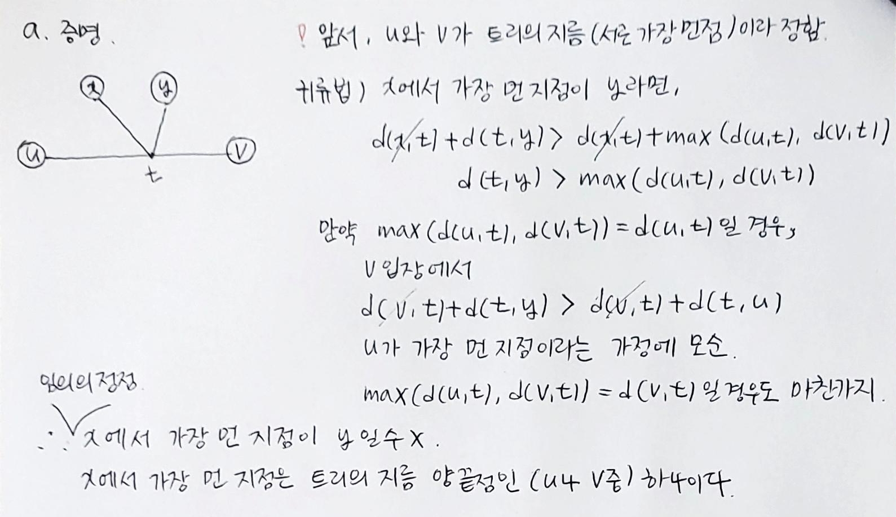
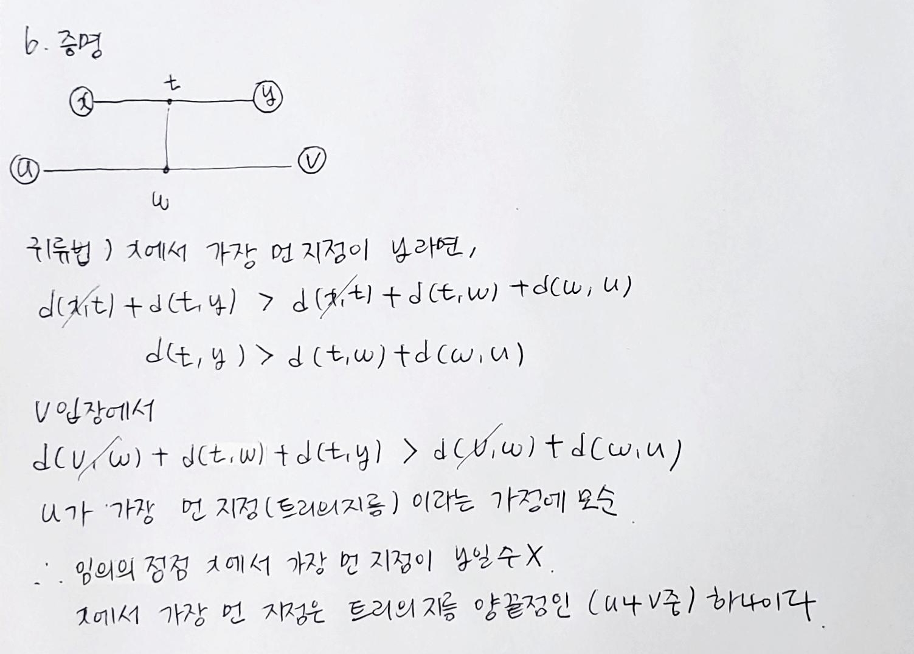

트리의 지름 구하기
===============
## 구하는 방법
    1. 트리에서 임의의 정점 x를 잡는다.
    2. 정점 x에서 가장 먼 정점 y를 찾는다.
    3. 정점 y에서 가장 먼 정점 z를 찾는다.   

## 증명
* 출처 : <https://blog.myungwoo.kr/112>

 트리에서 정점 u와 정점 v를 연결하는 경로를 트리의 지름이라 가정하자.   
 임의의 정점 x를 정하고, 정점 x에서 가장 먼 정점 y를 찾았을 때, 아래와 같이 경우를 나눌 수 있다.   

    1. x가 u혹은 v인 경우
    2. y가 u혹은 v인 경우
    3. x, y, u, v가 서로 다른 경우

1, 2 는 알고리즘으로 트리의 지름을 올바르게 구한다는 것을 알 수 있다.   
3에 대해서 알고리즘이 트리의 지름을 올바르게 구한다는 것을 증명하겠다. 3의 경우일 때 아래와 같이 두가지 경우가 가능하다   

    a. 정점 x와 정점 y를 연결하는 경로가 정점 u와 정점 v를 연결하는 경로와 한 점 이상 공유하는 경우
    b. 정점 x와 정점 y를 연결하는 경로가 정점 u와 정점 v를 연결하는 경로와 완전 독립인 경우

### 전제조건
    1. d(s, t) : 트리에서 정점 s와 정점 t 사이의 거리 
    2. 트리의 지름은 정점 u와 정점 v를 연결하는 경로라 가정   

### a. 증명
</img>

### b. 증명
</img>